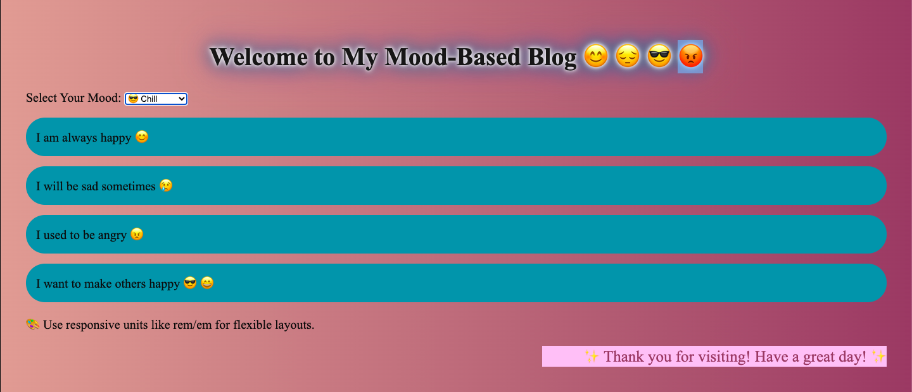

# 🎨 Mood Theme Switcher

  A fun and interactive webpage that changes the mood of the theme (Happy 😊 , Sad 😔, Angry 😡) using colorful buttons and smooth animations.

## 📸 Screenshots

## 🚀 Demo

[Live Demo](https://srujanachalluri.github.io/mood_theme_switcher/)

## 🛠️ Tech Stack

- HTML
- CSS
- JavaScript

## 📦 How to Run Locally

1. Clone the repository:

  bash
  git clone git@github.com:srujanachalluri/mood_theme_switcher.git
  cd mood_theme_switcher
  
  Open index.html in your browser.

That’s it! 🎉

📌 Features
Click a button to switch between moods

Smooth color transitions

Responsive design

🙌 Author
Srujana Challuri

